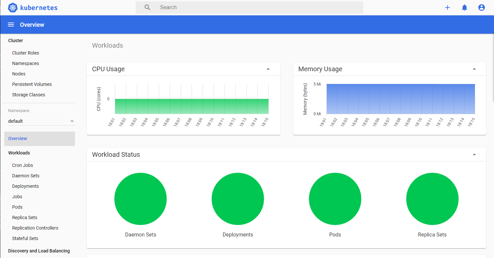

## Deploying the Kubernetes Dashboard

### Install the Dashboard from GitHub
Following the [instructions from the K3S documntation](https://rancher.com/docs/k3s/latest/en/installation/kube-dashboard/)

```
GITHUB_URL=https://github.com/kubernetes/dashboard/releases
VERSION_KUBE_DASHBOARD=$(curl -w '%{url_effective}' -I -L -s -S ${GITHUB_URL}/latest -o /dev/null | sed -e 's|.*/||')
sudo k3s kubectl create -f https://raw.githubusercontent.com/kubernetes/dashboard/${VERSION_KUBE_DASHBOARD}/aio/deploy/recommended.yaml


namespace/kubernetes-dashboard created
serviceaccount/kubernetes-dashboard created
service/kubernetes-dashboard created
secret/kubernetes-dashboard-certs created
secret/kubernetes-dashboard-csrf created
secret/kubernetes-dashboard-key-holder created
configmap/kubernetes-dashboard-settings created
role.rbac.authorization.k8s.io/kubernetes-dashboard created
clusterrole.rbac.authorization.k8s.io/kubernetes-dashboard created
rolebinding.rbac.authorization.k8s.io/kubernetes-dashboard created
clusterrolebinding.rbac.authorization.k8s.io/kubernetes-dashboard created
deployment.apps/kubernetes-dashboard created
service/dashboard-metrics-scraper created
deployment.apps/dashboard-metrics-scraper created
```

### Dashboard User Configuration

Create the following files:
#### dashboard.admin-user.yml
```
apiVersion: v1
kind: ServiceAccount
metadata:
  name: admin-user
  namespace: kubernetes-dashboard
```

#### dashboard.admin-user-role.yml
```
apiVersion: rbac.authorization.k8s.io/v1
kind: ClusterRoleBinding
metadata:
  name: admin-user
roleRef:
  apiGroup: rbac.authorization.k8s.io
  kind: ClusterRole
  name: cluster-admin
subjects:
- kind: ServiceAccount
  name: admin-user
  namespace: kubernetes-dashboard
```

Deploy the admin-user configuration:
```
sudo k3s kubectl create -f dashboard.admin-user.yml -f dashboard.admin-user-role.yml
```
Obtain the Bearer Token
```
sudo k3s kubectl -n kubernetes-dashboard describe secret admin-user-token | grep ^token
```
### Expose the Dashboard to the Network
The K3S documentation then shows how to make the dashboard available on a localhost port. Mine is headless so I want to expose it to my home network.
This is possible according to this [dashboard documentation](https://github.com/kubernetes/dashboard/blob/master/docs/user/accessing-dashboard/1.7.x-and-above.md). They do say
> only recommended for development environments in a single node setup

but that is fine for me.

```
sudo k3s kubectl -n kubernetes-dashboard edit service kubernetes-dashboard
```

Change `type: ClusterIP` to `type: NodePort` and save the file.

Now check which port it has been exposed on:
```
$ sudo k3s kubectl -n kubernetes-dashboard get service kubernetes-dashboard
NAME                   TYPE       CLUSTER-IP      EXTERNAL-IP   PORT(S)         AGE
kubernetes-dashboard   NodePort   10.43.173.211   <none>        443:31586/TCP   22h
```

So the dashboard is at https://k3sserver:31586. The browser warns about the certificate being invalid. Ignoring this we get to the login page. Choose token and use the token we got earlier.

Here is our first view of the dashboard overview page:



